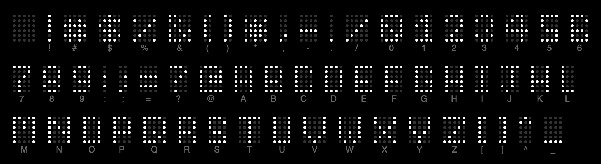
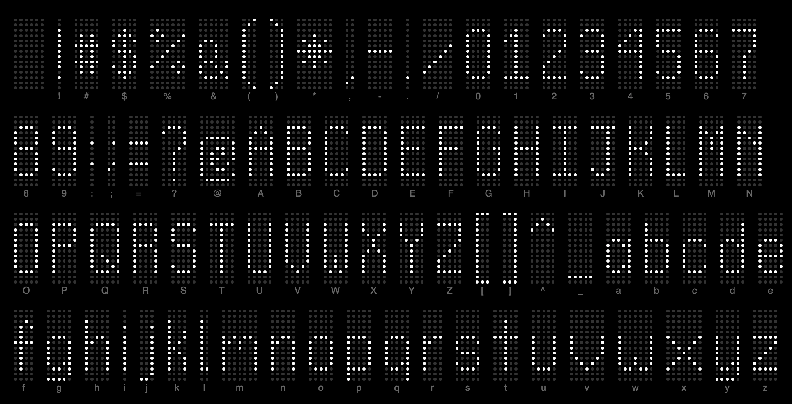
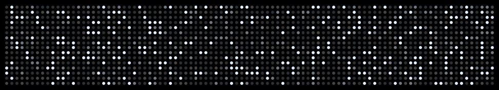
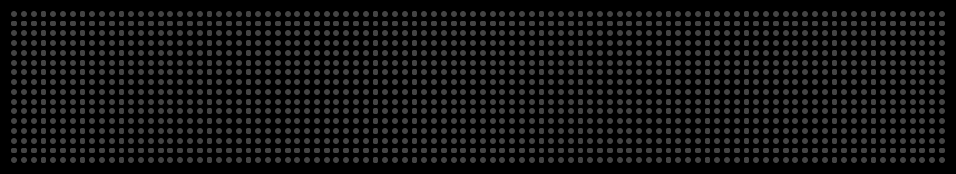
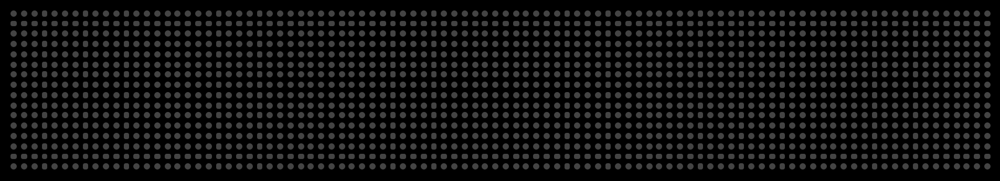
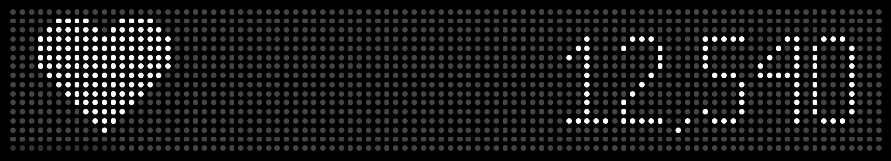
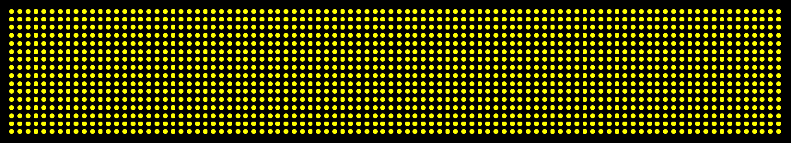
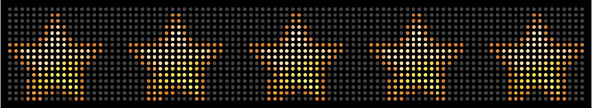
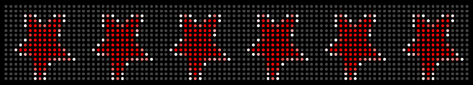

# Bigdots Display Engine

_**Interested in just rendering a display?** Checkout the [Web Client](https://github.com/bigdots-io/web-client)!_

## Install & Usage

```
npm install --save @bigdots-io/display-engine
```

```ts
import { createDisplayEngine } from "@bigdots-io/display-engine";
import { MacroName } from "@bigdots-io/display-engine/lib/types";

createDisplayEngine({
  macroName: MacroName.Twinkle,
  onPixelChange: ({ y, x, hex }) => {
    // Update the frontend of your display
  },
});
```

## Fonts

The following fonts are available to use when displaying text on your bigdots.io LED board.

### System 6



The smallest possible font, 6 dots high.

- Identifer: `system-6`
- Monospace: Yes
- Uppercase supported: Yes
- Lowercase supported: No
- Numbers supported: Yes
- Punction supported: Yes

### System 16



Designed for at least 16 dots high, though top and bottom padding is builtin.

- Identifer: `system-16`
- Monospace: No
- Uppercase supported: Yes
- Lowercase supported: Yes
- Numbers supported: Yes
- Punction supported: Yes

## Macros

These are all the available display macros for BigDots.io LED displays.

### Twinkle



```js
{
  color: "#FFFFFF";
}
```

### Marquee

The classic LED panel usecase...



```js
{
  color: '#FFFFFF',
  backgroundColor: '#000000',
  font: 'system-16',
  text: 'Replace with marquee text!',
  speed: 50
}
```

### Programmable

It's all on you. Use the the Node API to do whatever you want!



### Counter

Display a sum of an item or items via json from a url. The url should return json in the following structure...

```json
[{ "count": 12540 }]
```



```js
{
  loadingBarColor: '#333333',
  iconColor: '#FFFFFF',
  countColor: '#FFFFFF',
  icon: null,
  url: '',
  refreshInterval: 60
}
```

### Solid Color



```js
{
  color: "#FFFFFF";
}
```

### Image




```js
{
  url: '',
  speed: 10 // for GIFs
}
```
